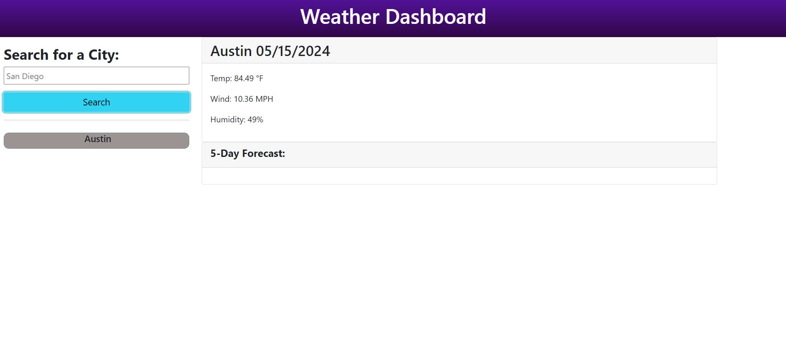

# Server-Side APIs: Weather Dashboard

## Description

This week's challenge involves using the skills and knowledge gained over the past several weeks of the UT Austin Coding Boot Camp course to build a weather dashboard application from scratch that runs in the browser using HTML, CSS, as well as JavaScript. Using the sever-side API, OpenWeather API, weather data was retrieved for cities by making requests with specific parameters to a URL and that data was then used in the context of this weather dashboard application.

This weather dashboard displays up-to-date current and future weather data for a city entered by a user. Viewing the current weather conditions and a five-day forecast for a specific city reveals weather details including the city name, the date, a weather icon representing the weather condition, as well as the temperature in Fahrenheit, humidity percentage, and wind speed in miles per hour. After the city is entered and the weather data is displayed on the dashboard, each city is also saved on the webpage and can be accessed quickly once again by clicking on the city name to reveal the weather data for that city. Additionally, the cities entered are saved in local storage so that they remain on the page if the page is closed or refreshed.

This weather dashboard application enables individuals, most notably those who are traveling to multiple cities and need to plan their trips accordingly, to easily access and view the current and future weather conditions of those cities. Through completing this challenge, I was able to improve my understanding of the workings of server-side APIs and how they are beneficial in helping developers access and retrieve data from an application developed by another individual or company in order to apply that retrieved data to a current project.

For this project, I had a very difficult time getting the 5-day forecast information to display as well as the icons. Thus, after multiple attempts, the 5-day forecast and the icons were not displayed in the final deployment.


## User Story

```
AS A traveler
I WANT to see the weather outlook for multiple cities
SO THAT I can plan a trip accordingly
```
## Acceptance Criteria

```
GIVEN a weather dashboard with form inputs
WHEN I search for a city
THEN I am presented with current and future conditions for that city and that city is added to the search history
WHEN I view current weather conditions for that city
THEN I am presented with the city name, the date, an icon representation of weather conditions, the temperature, the humidity, and the wind speed
WHEN I view future weather conditions for that city
THEN I am presented with a 5-day forecast that displays the date, an icon representation of weather conditions, the temperature, the wind speed, and the humidity
WHEN I click on a city in the search history
THEN I am again presented with current and future conditions for that city
```

## Mock Up
The following image shows the web application's appearance:



## Link to Deployed Application

https://vaughanknouse.github.io/weather-dashboard-server-side-api/

## Credits
Used the following sources as tutorials and guidelines:

The OpenWeatherMap API: https://openweathermap.org/forecast5.

Ninja Net's Bootstrap 5 Crash Course Tutorials: https://www.youtube.com/playlist?list=PL4cUxeGkcC9joIM91nLzd_qaH_AimmdAR

"How to Use API Keys" article: https://coding-boot-camp.github.io/full-stack/apis/how-to-use-api-keys/ 

Also utilized the Xpert Learning assistant for some portions of my code:
https://bootcampspot.instructure.com/courses/5293/external_tools/313
